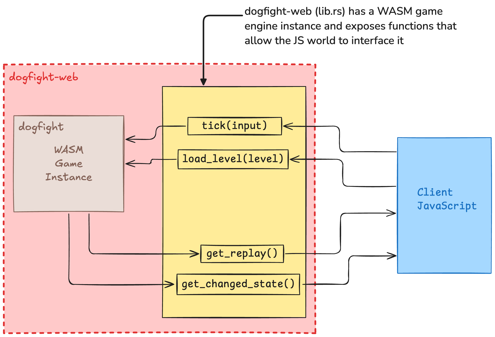

# Lentokonepeli

> Fly your planes to victory as you re-create the aerial battles of the First World War!

This is a modern remake of the competitive 2D multiplayer airplane game [Lentokonepeli](https://www.youtube.com/watch?v=qCCCUXUwlT8)
(_Literal translation from Finnish: "airplane game", also known in English as Dogfight_).

⚠️ **CURRENTLY IN DEVELOPMENT** ⚠️

## Discord

[Join us on Discord](https://discord.gg/QjtXPmx) if you are interested in staying up to date on the remake of this game
and interact with the community.

## History

The game was originally created in 2005 by the Finnish game studio [Playforia (Aapeli)](https://en.wikipedia.org/wiki/Playforia).
Their gaming website was built in 2002 entirely on Java.
As web browsers would begin to treat Java as a security risk,
their website became less and less accessible
until it was permanently shut down in 2019.

With the death of Playforia, Dogfight should have died too.
Fortunately, I was able to download a copy of the [client-side jar](https://github.com/mattbruv/playray-dogfight-client) file before the site went offline.
This jar file contained game assets such as images and audio.
It is now possible to recreate the game using these assets, along with reverse engineering the physics through captured video and other documentation.

In late 2020, the original creator of the game was able to reach out to the parent company that acquired Aapeli, and they were gracious enough to provide us with the server-side JAR file.
We are able to decompile this and use that to faithfully recreate the game physics and other details which would have been impossible to figure out from video.

The purpose of this project is to bring this nostalgic game back to life and keep it alive forever.

## Development

### Repo Structure

#### Game/Server

The game engine is written in Rust.
You will also need wasm-pack installed in order to export the game to WASM so it can run in the browser: `cargo install wasm-pack`.

You can build all of the Rust code and generate a WebAssembly build
by simply running `python3 build.py` which will:
  - Build the main game engine
  - Generate TypeScript types from the game engine types
  - Build the WebAssembly binary and JavaScript bridge to enable the game engine to run in the browser

The Rust code consists of three projects:

- [./dogfight](./dogfight/): The main game engine and game logic/types.
- [./dogfight/dogfight-macros/](./dogfight/dogfight-macros/):
  The procedural macros used by the game.
  Macros are used to automatically generate repetitive networking code to serialize and deserialize game objects to and from binary to minimize data sent over the network.
- [./dogfight/dogfight-web/](./dogfight/dogfight-web/):
  A WASM <---> JS interface for the dogfight game, which exports a package enabling dogfight to run in the browser.
  - NOTE: If you make changes to function signatures or introduce new functions, you should restart your frontend dev server after the build process so it will bundle the latest build. If you don't do this, the dogfight-web library on the client might be out of sync with its type declaration file and cause runtime errors.

Here is a diagram which helps understand dogfight-web and how JS uses it to interface with the game engine:

#### Web Client

All of the frontend code is written in [TypeScript](https://www.typescriptlang.org/).
The web client is rendered with [React](https://react.dev/)
and uses [Mantine](https://mantine.dev/) components.
The game world is rendered using [pixi.js](https://pixijs.com/).
[Peer.js](https://peerjs.com/) is used to allow users to easily host a game and connect to each other via WebRTC.

- [./client/src/](./client/src/):
  The main React web user interface
  - `npm install`
  - Run with `npm run dev`
- [./client/src/client/](./client/src/client/):
  The logic for rendering a game world.

## Acknowledgments

- Aapeli (Playforia) for creating decades of entertainment and friendships through their internet gaming platform.
- [Pyry Lehdonvirta](https://pyry.lehdonvirta.com/), the original programmer of Lentokonepeli.
- [Pallosalama](https://www.youtube.com/user/tappajaav) for his many high quality recordings and documentation of [maps](./docs/images/map-screenshots) and other important game information.
- Members of [Munkkiliiga](http://munq.arkku.net/) (and everyone else in the discord server) for being such dedicated fans to the game, and having the patience to work with me.
  Their passion and enthusiasm for the game inspired me greatly.
