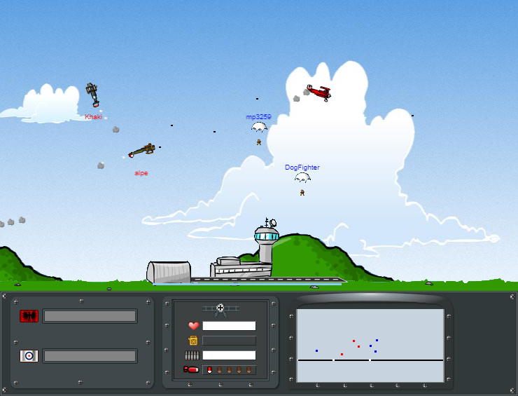

# UPDATE 2020-10-28
## WE HAVE THE ORIGINAL SOURCE CODE!
Yes, you read that right. We have the original source code as of October 28th, 2020.
Using the original source code as a reference, I plan to fully re-create the game in the coming months. Stay tuned! Join our discord to stay up to date.

# Lentokonepeli
> Fly your planes to victory as you re-create the aerial battles of the First World War!

This is a modern remake of the competitive 2D multiplayer airplane game [Lentokonepeli](https://www.youtube.com/watch?v=qCCCUXUwlT8)
(*Literal translation: "airplane game", also known as Dogfight*).

## Discord
[Join us on Discord](https://discord.gg/QjtXPmx) if you are interested in staying up to date on the remake of this game
and interact with the community.

## History
The game was originally created in 2005 by the Finnish game studio [Playforia (Aapeli)](https://en.wikipedia.org/wiki/Playforia).
Their gaming website was built in 2002 entirely on Java.
As web browsers would begin to treat Java as a security risk,
their website became less and less accessible
until it was permanently shut down in 2019.

With the death of Playforia, Dogfight should have died too. 
Fortunately, I was able to download a copy of the [client-side jar](https://github.com/mattbruv/playray-dogfight-client) file before the site went offline.
This jar file contained game assets such as images and audio.
It is now possible to recreate the game using these assets, along with reverse engineering the physics through captured video and other documentation.

The purpose of this project is to bring this nostalgic game back to life and keep it alive forever.

## Development
Building the source code and/or running a multiplayer server requires [Node.js](https://nodejs.org) and npm.

#### Set up your environment (one time only)
1. Download the repository:
`git clone https://github.com/mattbruv/Lentokonepeli.git`
2. Install the project dependencies:
`cd Lentokonepeli && npm install`
3. Prepare the game assets:
`npm run setup`
4. Create an initial build:
`npm run build`

You are now ready to run the game in any one of the following scenarios:

**Development Mode:** `npm run watch-client` in one terminal and `npm run server` in another. This creates a game server, and automatically refreshes any changes made to client-side code. Any changes to the server will need to be manually reset.

Visit the server at http://localhost:3259/.

**Serverless:** `npm run no-server` to create a development environment where the game server is run locally in the client, and no websocket connections are made.

**Game Server Only:** `npm run server` to create a HTTP/Websocket server that will host the game files and run a game server instance.

#### Building the game

Build a production-ready version of the client by running either `npm run build` for a build that will connect to your server, or `npm run build-no-server` to build a client which runs a server locally.

## Acknowledgments

* Aapeli (Playforia) for creating decades of entertainment and friendships through their internet gaming platform.
* [Pyry Lehdonvirta](https://pyry.lehdonvirta.com/), the original programmer of Lentokonepeli.
* [Pallosalama](https://www.youtube.com/user/tappajaav) for his many high quality recordings and documentation of [maps](./docs/images/map-screenshots) and other important game information.
* Members of [Munkkiliiga](http://munq.arkku.net/) (and everyone else in the discord server) for being such dedicated fans to the game, and having the patience to work with me. 
Their passion and enthusiasm for the game inspired me greatly.
  * Puckyle ([APN-Pucky](https://github.com/APN-Pucky))
  * latesofi
  * Vata56
  * Boxer
